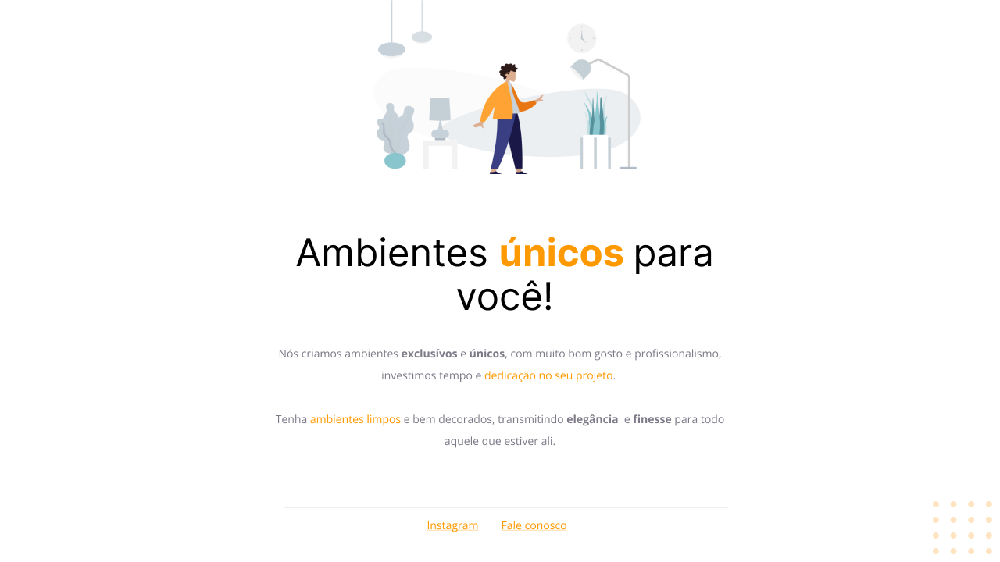

  

## 🚀 Tecnologias

Esse projeto foi desenvolvido com as seguintes tecnologias:

- [HTML](https://developer.mozilla.org/pt-BR/docs/Web/HTML)
- [CSS](https://developer.mozilla.org/pt-BR/docs/Web/CSS)

## 💻 Projeto

O projeto Móveis customizados é sistema de apresentação de uma empresa de ambientes, ele foi elaborado na aula do programa Explorer da Rocketseat.

## 🔖 Layout

No link abaixo você encontra o layout do projeto web. Lembrando que você precisa ter uma conta no [Figma](http://figma.com/) para acessá-lo.

- [Layout Web](https://www.figma.com/file/lI8MSbICTKpDjGb1AYSSPF/Explorer---Projeto-01-(Copy)?node-id=0%3A1)

